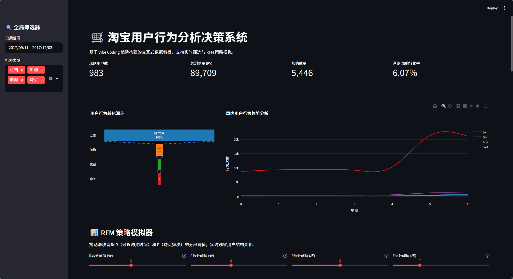
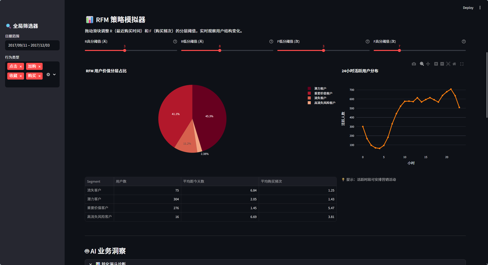
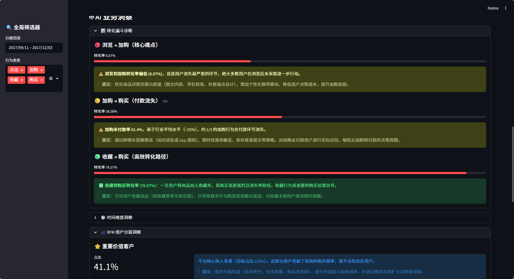
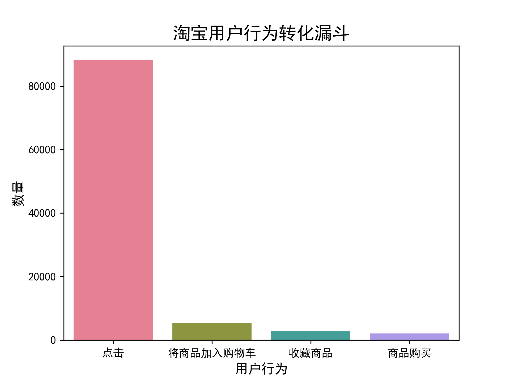
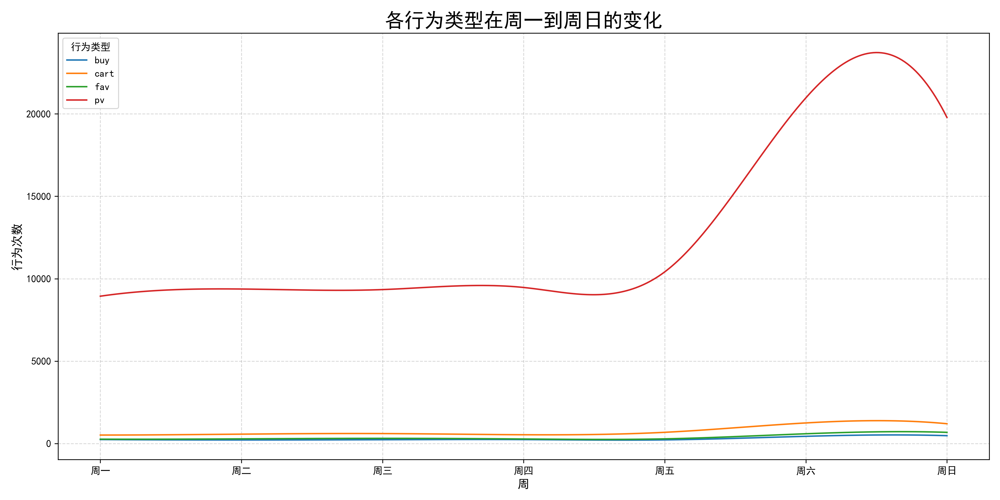
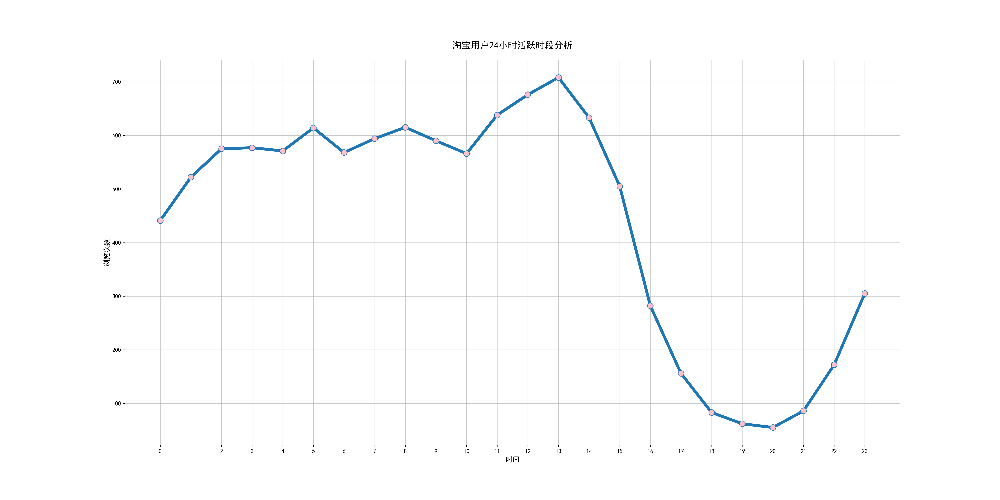
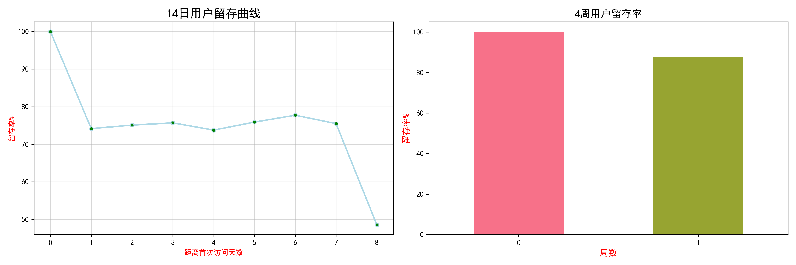
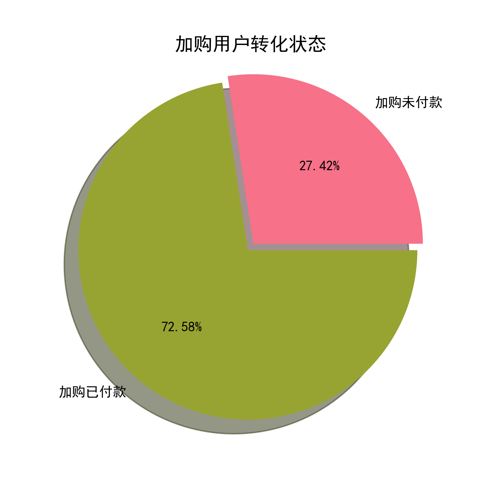
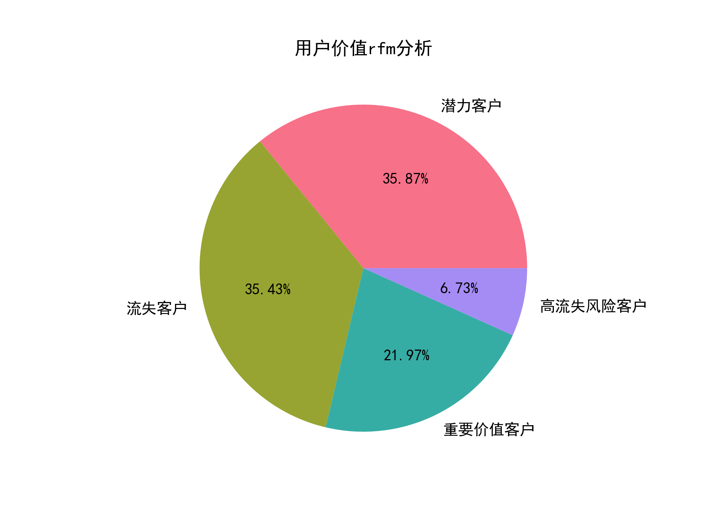

[README.md](https://github.com/user-attachments/files/27961792/README.md)
# 淘宝用户行为分析与价值分层

数据来源：[https://tianchi.aliyun.com/dataset/649](https://tianchi.aliyun.com/dataset/649)

## 项目概述

本项目旨在对实际用户于平台上的行为数据进行用户行为分析与价值分层。通过分析用户行为转化漏斗、行为类型与活跃度时间序列变化、留存率、用户价值rfm模型分层，挖掘用户行为规律与转化痛点，为平台提供页面优化、精细运营、用户管理和营销策略提供可靠的数据支持与理论基础。

**新增功能（2026-06）：** 基于 Streamlit 构建的交互式数据看板，支持动态筛选器、RFM 策略模拟器和 AI 业务洞察，实现数据的实时可视化分析。

## 🚀 快速开始

### 本地运行

1. 安装依赖：
```bash
pip install -r requirements.txt
```

2. 确保 `UserBehavior.csv` 文件位于项目根目录

3. 启动应用：
```bash
streamlit run src/app.py
```

4. 在浏览器中打开 http://localhost:8501

### 项目结构

```
taobao_User_behavior_Analysis/
├── src/                    # 源代码目录
│   ├── __init__.py
│   ├── app.py             # Streamlit主应用
│   ├── data_loader.py     # 数据加载与清洗模块
│   ├── rfm_engine.py      # RFM用户分层引擎
│   ├── visuals.py         # 可视化图表模块
│   └── ai_insights.py     # AI业务洞察模块
├── tests/                  # 测试文件目录
│   └── test_app.py        # 单元测试脚本
├── docs/                   # 文档目录
│   ├── DEPLOYMENT.md      # 部署指南
│   └── OPTIMIZATION_SUMMARY.md  # 优化总结
├── demo/                   # 演示资源目录
├── images/                 # 分析报告图片目录
├── assets/                 # 静态资源目录
├── requirements.txt        # Python依赖
├── .gitignore             # Git忽略配置
└── UserBehavior.csv       # 数据文件（需自行下载）
```

**说明**：核心代码位于 `src/` 目录，测试文件在 `tests/`，文档在 `docs/`，保持清晰的项目结构。

### 部署到云端

详细部署指南请参考 [DEPLOYMENT.md](DEPLOYMENT.md)

#### Hugging Face Spaces
1. 创建 Space（选择 Streamlit 模板）
2. 上传代码文件（排除 UserBehavior.csv）
3. 自动部署完成

#### Streamlit Cloud
1. 将代码推送到 GitHub
2. 在 [Streamlit Cloud](https://streamlit.io/cloud) 连接仓库
3. 设置主文件为 `app.py` 并部署

---

## 🎬 项目演示

### 在线演示视频

欢迎观看在线演示视频[User Behavior Analysis and Decision-Making System](https://github.com/user-attachments/assets/3f76ac63-abe2-4c75-97f7-2c8d6c1ff693)，下载：[taobao_demo.mp4](demo/taobao_demo.mp4)

### 看板截图







---

## 数据来源与描述

- **数据来源**: `UserBehavior.csv` 文件。
- **数据量**: 原始数据包含约 1 亿条用户行为记录。
- **时间范围**: 清洗和筛选后的数据涵盖时间段为 2017年11月25日至2017年12月3日。
- **字段说明**:
  - `user id`: 用户ID。
  - `item id`: 商品ID。
  - `item category id`: 商品类别ID。
  - `behavior type`: 用户行为类型 (pv: 浏览, cart: 加入购物车, fav: 收藏, buy: 购买)。
  - `time`: 行为发生的时间戳。

## 交互式数据看板功能

### 🎯 核心特性

1. **动态筛选器**
   - 日期范围选择：支持自定义分析时间段
   - 行为类型多选：点击、加购、收藏、购买可自由组合
   - 实时联动：所有图表随筛选条件自动重绘

2. **RFM 策略模拟器**
   - R（最近购买时间）阈值调整：自定义高分/低分天数边界
   - F（购买频次）阈值调整：自定义高频/低频次数边界
   - 实时计算：调整后立即更新用户分层占比和统计指标
   - 可视化展示：饼图 + 数据表格双视图

3. **AI 业务洞察**
   - 自动诊断转化率问题
   - 核心用户占比分析
   - 流失风险预警
   - 流量高峰时段识别

4. **关键指标看板**
   - 活跃用户数
   - 总浏览量 (PV)
   - 加购数量
   - 浏览-加购转化率

5. **多维图表分析**
   - 用户行为转化漏斗
   - 周内行为趋势（带平滑曲线）
   - 24小时活跃分布
   - RFM 用户价值分层

### 📊 技术栈

- **前端框架**: Streamlit
- **可视化库**: Plotly
- **数据处理**: Pandas + NumPy
- **平滑算法**: SciPy CubicSpline
- **缓存机制**: Streamlit `@st.cache_data`

---

## 项目步骤目录

### 前置工作

1. 导入工具
2. 创建文件目录
3. 连接数据库

### 数据预处理

1. 查看数据基本情况
2. 数据清洗

### 核心数据分析

1. 用户行为转化漏斗
2. 行为类型周内变化趋势
3. 用户活跃时段分析
4. 用户留存率分析
5. 加购未付款分析

### 用户画像

1. 获取购买频率frequency
2. 获取最近一次购买时间recency
3. 构建rfm模型

## 具体步骤与相关结论

### 数据清洗与准备

1. **加载数据**: 使用 pandas 加载 `UserBehavior.csv` 文件。
2. **处理缺失值**: 检查并确认数据无缺失值。
3. **处理重复值**: 删除重复的用户行为记录。
4. **时间格式转换**: 将时间戳转换为北京时间 (UTC+8)，格式为 `datetime`。
5. **异常日期过滤**: 筛选出指定时间范围内 (2017-11-25 00:00:00 至 2017-12-03 23:59:59) 的数据。
6. **特征提取**: 从时间数据中提取星期 (`weekday`) 和小时 (`hour`) 作为新的特征。

### 用户行为转化漏斗

用户跟踪用户从浏览到购买的转化路径和流失情况。

#### 漏斗计算逻辑

1. **排序**: 按时间对用户行为日志排序。
2. **首次行为时间**: 对每个用户、每个商品，获取其首次发生 pv, cart, fav, buy 的时间。
3. **时间顺序约束**: 在计算漏斗时，确保行为发生的时间顺序符合漏斗路径。
4. **指标计算**:
   - 统计每个环节（pv, cart/fav, buy）的**唯一用户商品对**数量（即有多少 "人次" 完成了该环节）。
   - 计算相邻环节的转化率和从起点到终点的总转化率。

#### 漏斗分析结果可视化



#### 漏斗分析结论：

**浏览到加购的转化率很低**：这是用户价值流失的最严重的环节，需要着重优化

**加购、收藏、购买链路转化率较优**：表明一旦用户将商品加入购物车或收藏夹，则其购买意愿强烈且流失率低

### 探索性数据分析——时间维度分析

#### 行为类型周内变化趋势

通过按星期 (`weekday`) 和行为类型 (`behavior_type`) 分组，统计了不同行为在一周内的发生次数。



**行为类型变化趋势结论**：所有用户行为在**周末（周六、周日）显著增加**，其中浏览量 (pv) 在周末激增最为明显。工作日（周一至周五）的行为次数相对平稳，略有波动。

#### 用户活跃时段分析

以每个小时（hour）为维度，统计每小时活跃人数



**活跃人数时段趋势结论**：上午每小时浏览人数逐步上升并在中午时段达到峰顶，然后开始下降并在傍晚时分达到峰谷，夜间活跃人数再次上升，整体成波浪型。

### 用户留存率分析

统计每日/每周用户留存率。



**用户留存率情况结论**：14日留存曲线整体呈下降趋势，首周留存约74%-78%，8日降至48%；周留存次周约88%。

### 加购未付款分析

加购未付款是用户行为路径中，提升平台gmv的一个重要环节，探讨加购未付款的情况和原因以为业务方向提供支持



**加购未付款情况结论**：大约1/3的加购存在付款环节流失，处于行业平均水平。

### 用户价值rfm模型分层

RFM 模型通过三个维度评估用户价值：

- **Recency (R)**: 用户最近一次消费时间距今的天数。
- **Frequency (F)**: 用户在统计周期内的消费次数。
- **Monetary (M)**: 用户在统计周期内的消费总金额 (注：本数据集中无金额信息，因此只进行 RF 分析)。



**rfm模型分层结论**：

- **潜力客户和流失客户占比最高**: 两者合计超过 70%。这表明平台有大量近期有过购买但频次不高的用户，以及大量低频且近期未购买的用户。
- **重要价值客户是核心**: 虽然占比只有 21.97%，但这部分用户贡献了较高的购买频率，是平台的忠实用户和主要收入来源。
- **高流失风险客户需重点关注**: 占比虽小 (6.73%)，但这部分用户曾经是高频购买者，近期活跃度下降，挽回价值较高。

## 整体项目对业务的建议

### 一、优化浏览到加购的转化路径（核心痛点）

转化漏斗显示，浏览到加购是流失最严重的环节，绝大多数用户在浏览后未采取任何进一步行动。建议重点优化商品详情页的展示质量，包括图文内容、评价权重、价格锚点设计以及个性化推荐模块，降低用户决策成本，提升加购意愿。

### 二、降低加购未付款流失率

当前约 27.42% 的加购用户未完成付款，处于行业平均水平但仍有改善空间。建议通过购物车提醒推送（站内消息或 App 通知）、限时优惠券触发、库存紧张提示等策略，对加购未付款用户进行定向召回，缩短从加购到付款的决策周期。

### 三、把握周末与午间的流量高峰

用户行为数据显示，浏览量在周末（尤其是周六）显著攀升，日内在午间（13:00 前后）达到峰值，夜间也有二次高峰。建议将重要的营销活动、新品上线、优惠券发放等运营动作集中在周末和每日 11:00–14:00、20:00–23:00 时段，以实现最大曝光与转化效益。

### 四、提升次周及中长期用户留存

14 日留存曲线在第 8 天出现明显跌落，说明用户在初次访问约一周后流失风险显著增加。建议在用户首次使用后第 5–7 天触发针对性的互动机制，如个性化商品推荐、签到奖励、购后好评激励等，延缓流失并引导用户形成稳定的访问习惯。

### 五、针对 RFM 分层实施差异化运营

- **重要价值客户（21.97%）**：作为平台核心收入来源，应提供专属权益（如会员积分、优先客服、新品优先购），提升忠诚度与复购频率。
- **潜力客户（35.87%）**：近期有过购买但频次较低，具备较高转化潜力，建议通过个性化推荐和定向满减活动刺激二次购买。
- **高流失风险客户（6.73%）**：曾为高频用户但近期活跃度下降，挽回价值高，建议通过专属折扣或一对一触达进行重点召回。
- **流失客户（35.43%）**：占比最高，整体唤回成本较大，建议以低成本的内容推送为主，不宜投入过重营销资源，优先聚焦中高价值群体。


